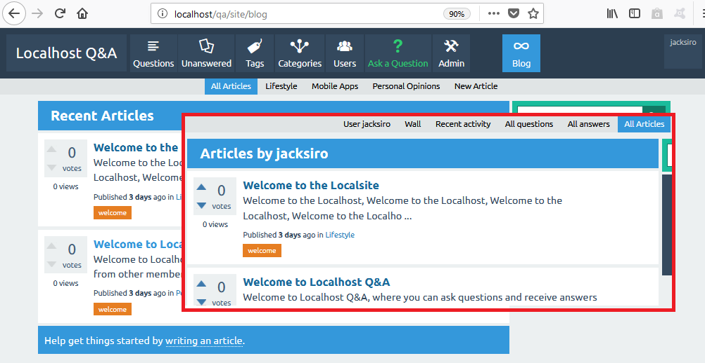
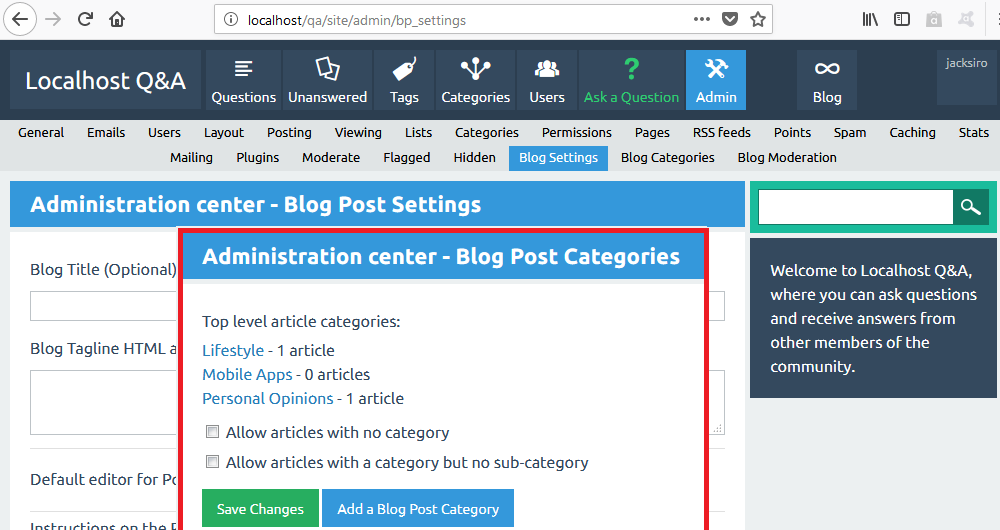
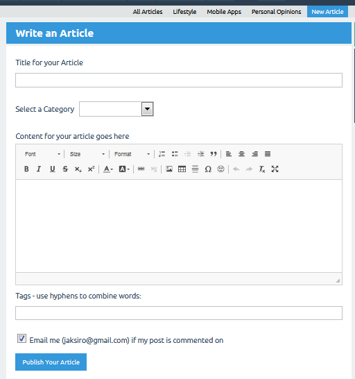

# Q2A Blog Post

The Blog post plugin allows registered users to maintain a blog on their Q2A site. Blogs are made up of individual blog entries. By default, the blog entries are displayed by creation time in descending order.

## Installing Instructions
If you have never installed my Q2A plugins before please consider checking the [Installation Guide](https://github.com/JacksiroKe/q2a-blog-post/edit/master/INSTALLING.md)

## Features
1. Article and Category management like Questions.
2. Uses default user interface/theme.

3. Admin panel for managing blog settings and categories.

4. It uses the editor selected by the admin in settings.

## Sites with this Plugin
1. [My Q2A Test Site](https://qtoa.appsmata.com/blog)

### Get your site added here by submitting a pull request or an issue or emailing me.
